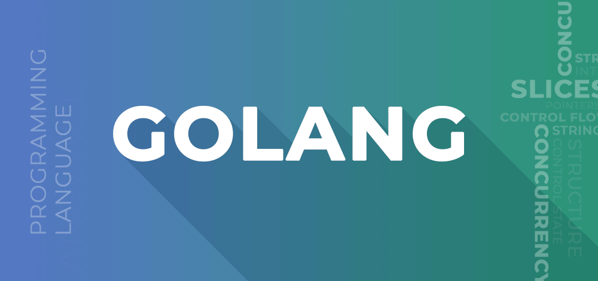

# Golang GeeksforGeeks

**Golang** is a procedural and statically typed programming language having the syntax similar to ****C**** programming language. Sometimes it is termed as  ****Go Programming Language**** . It provides a rich standard library, **[garbage collection](https://www.techtarget.com/searchstorage/definition/garbage-collection)**, and dynamic-typing capability. It was developed in 2007 by Robert Griesemer, Rob Pike, and Ken Thompson at Google but launched in 2009 as an open-source programming language and mainly used in Google’s production systems. Golang is one of the most trending programming languages among developers.

Go is known for its support for concurrency, which is the ability to run multiple tasks simultaneously. Concurrency is achieved in Go through the use of **Goroutines** and **Channels**, which allow you to write code that can run multiple operations at the same time. This makes Go an ideal choice for building high-performance and scalable network services, as well as for solving complex computational problems.

**Here are some key features of Go:**

1. Simplicity: Go is designed to be easy to learn and use. Its syntax is simple and straightforward, making it a good choice for beginners and experienced programmers alike.
2. Concurrency: Go has built-in support for concurrency, allowing developers to write efficient and scalable code for multicore and distributed systems.
3. Garbage collection: Go has automatic memory management, which frees developers from having to worry about memory allocation and deallocation.
4. Fast compile times: Go has a fast compiler, which makes it easy to iterate quickly during development.
5. Cross-platform support: Go can be compiled to run on many different platforms, including Windows, Linux, and macOS.
6. Strong typing: Go is a statically typed language, which helps catch errors at compile time rather than at runtime.
7. Go has a large and growing community of developers and is used by many well-known companies, including Google, Uber, and Dropbox.

**Here are some important points to keep in mind about Go programming language:**

1. Go is a statically typed language, which means that the type of a variable must be declared before it can be used.
2. Go has a built-in garbage collector that automatically frees up memory when it is no longer needed.
3. Go has strong support for concurrency, allowing developers to write efficient and scalable code for multicore and distributed systems.
4. Go has a minimalist syntax that is easy to learn and read.
5. Go has a fast compiler that generates code that is optimized for modern hardware architectures.
6. Go has a standard library that provides support for a wide range of functionality, including networking, encryption, and file handling.
7. Go has a growing community of developers and a vibrant ecosystem of third-party packages and tools.
8. Go is used by many well-known companies for building large-scale distributed systems and high-performance applications.
9. Overall, Go is a powerful and efficient programming language that is well-suited for building modern applications and distributed systems. Its strong support for concurrency and minimalist syntax make it an attractive choice for developers who want to build scalable and efficient applications.

**Advantages:**

1. ****Flexible**** – It is concise, simple and easy to read.
2. ****Concurrency**** – It allows multiple process running simultaneously and effectively.
3. ****Quick Outcome**** – Its compilation time is very fast.
4. ****Library-**** It provides a rich standard library.
5. ****Garbage collection**** – It is a key feature of go. Go excels in giving a lot of control over memory allocation and has dramatically reduced latency in the most recent versions of the garbage collector.
6. It validates for the **interface** and **type embedding** and **system programming**.
7. ****Concurrency**** : Go provides excellent support for concurrency, making it easy to write code that can run multiple tasks simultaneously. This is achieved through Goroutines and Channels, which allow you to write code that can run multiple operations at the same time.
8. ****Performance**** : Go is designed to be fast and efficient, with a focus on performance and low memory usage. This makes it well-suited for building high-performance network services, as well as for solving complex computational problems.
9. ****Simplicity:**** Go has a straightforward syntax and a simple type system, making it easy to learn and use, even for people with no prior programming experience.
10. ****Garbage Collection:**** Go has built-in garbage collection, which automatically manages memory for you. This eliminates the need for manual memory management, reducing the likelihood of memory leaks and other bugs that can arise from manual memory management.
11. **Statically Typed:** Go is a statically typed language, which means that types are determined at compile time. This provides stronger type safety and makes it easier to catch type-related bugs before they occur.
12. **Testing Support:** Go provides us the unit testing features by itself i.e., a simple mechanism to write your unit test parallel with your code because of this you can understand you code coverage by your own tests. And that can be easily used in generating your code documentation as an example.

****Disadvantages:****

1. It has no support for **[generics](https://www.geeksforgeeks.org/generics-in-java/)**, even if there are many discussions about it.
2. The packages distributed with this programming language is quite useful but Go is not so object-oriented in the conventional sense.
3. There is absence of some libraries especially a UI tool kit.
4. Limited Object-Oriented Features: Go does not have full-fledged object-oriented features like inheritance and polymorphism. This can make it more difficult to write complex programs, especially for developers who are used to traditional object-oriented languages.
5. No Generics: Go does not have built-in support for generics, which makes it difficult to write reusable code.
6. Immature Standard Library: Go’s standard library is relatively new and still maturing, which can make it difficult to find the tools you need for a particular task.

****Some popular Applications developed in Go Language****

* **Docker**: a set of tools for deploying linux containers.
* ****Openshift:**** a cloud computing platform as a service by Red Hat.
* ****Kubernetes:**** The future of seamlessly automated deployment processes.
* ****Dropbox:**** migrated some of their critical components from Python to Go.
* ****Netflix:**** for two part of their server architecture.
* ****InfluxDB:**** is an open-source time series database developed by InfluxData.
* ****Golang:**** The language itself was written in Go.

---

|                Category                | Details |
| :-------------------------------------: | ------- |
|    ****Fundamentals****    |         |
| ****Control Statements**** |         |
| ****Functions & Methods**** |         |
|      ****Structure****      |         |
|       ****Arrays****       |         |
|       ****Slices****       |         |
|       ****Strings****       |         |
|      ****Pointers****      |         |
|     ****Interfaces****     |         |
|     ****Concurrency****     |         |
